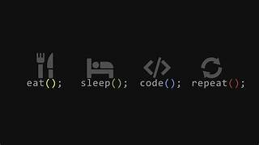

<h1 align="center">
    
</h1>

<h3 align="center"><i> Computer Engineering Student , passionate about learning new things and exploring in the field of Full stack Development</i></h3>

<h2 align="center"><b>👨🏻‍💻 About Me 👨🏻‍💻</b></h2>

 

    
- 👨‍🎓 I’m currently Pursuing a **BTech in Computer Technology**  
    

- 🔭 I’m currently working on : **Increasing  Programming knowledge and Problem-Solving Skills**  
 
- 💬 Ask me about : **Java, C++, HTML, CSS, Php, Javascript , React-Js , NodeJs , ExpressJs**  
 
- 📫 How to reach me : **<a href="mailto: snehalbahalkar2004@gmail.com">snehalbahlkar2004@gmail.com</a>**  

 

<h2 align="center"><b>🔗 Connect with Me 🔗</b></h2>
 

    &nbsp;
    
    

 

     
     

 

 
       
        
</td>
<td></td>
</tr>
</table>

 

<table>
<tr>
<td>  
    

</td>
<td></td>
</tr>
</table>

<h2 align="center"><b>💼 For More Info, Visit .... 💼</b></h2>
 

    
      
    

